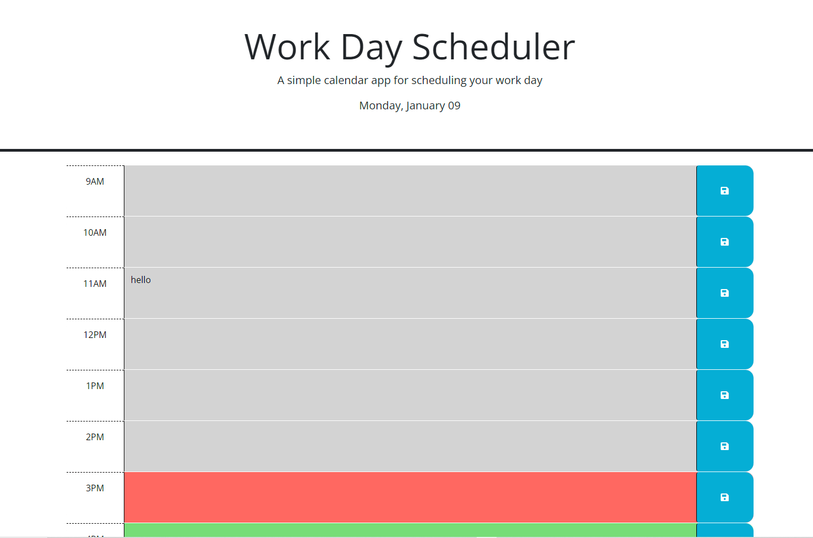

# Scheduler
## Description

This application targets employee's with a busy schedule
who want to add important events to a daily planner
so that people can manage their time effectively

## Usage

## Features

The background of the hour rows will change colors based on whether or not the hour is current with the time on the page. Gray for past, Red for current and Green for future. Any information entered in will be applied to the local storage and saved. To delete the information from storage just delete the text you inputed.